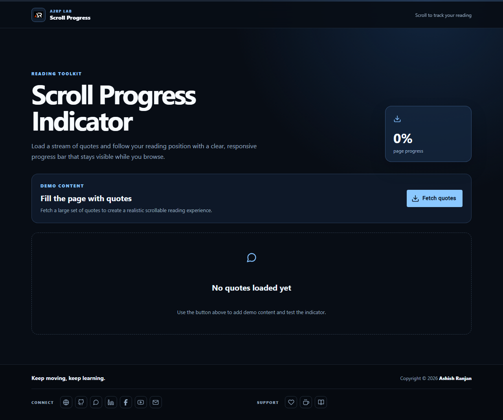

# Scroll Progress Indicator

A responsive React demo that fetches quotes and shows reading progress while the page is scrolled.

## Features

- Visible fixed progress bar with current percentage
- Fetches demo quotes from DummyJSON
- Responsive quote cards with loading and empty states
- Fixed branded header, icon-only footer links, and scroll-to-top control

## Tech stack

React, Create React App, JavaScript, Sass, Material UI, Axios, and react-icons.

## Run locally

```bash
npm install
npm start
```

Create a production build with `npm run build`. Deploy with `npm run deploy`.

## Live

[Open the Scroll Progress Indicator](https://a2rp.github.io/scroll-progress-indicator/)



## Links

- [Portfolio](https://www.ashishranjan.net/)
- [GitHub](https://github.com/a2rp)
- [CodePen](https://codepen.io/ash1198)
- [LinkedIn](https://www.linkedin.com/in/aashishranjan)
- [Facebook](https://www.facebook.com/theash.ashish/)
- [YouTube](https://www.youtube.com/@ashishranjan-ashz?sub_confirmation=1)
- [Email](mailto:ash.ranjan09@gmail.com)

## Support

- [Support](https://a2rp-donation-page.netlify.app/)
- [Buy Me a Coffee](https://buymeacoffee.com/a2rp)
- [Patreon](https://patreon.com/a2rp)
